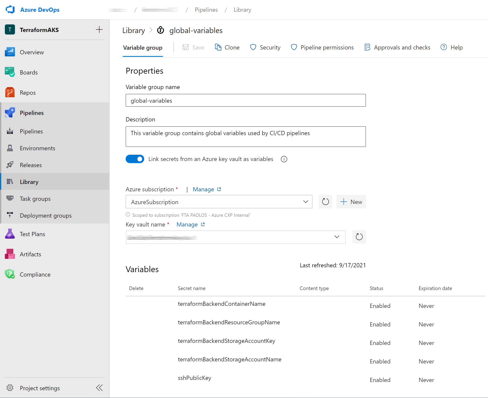
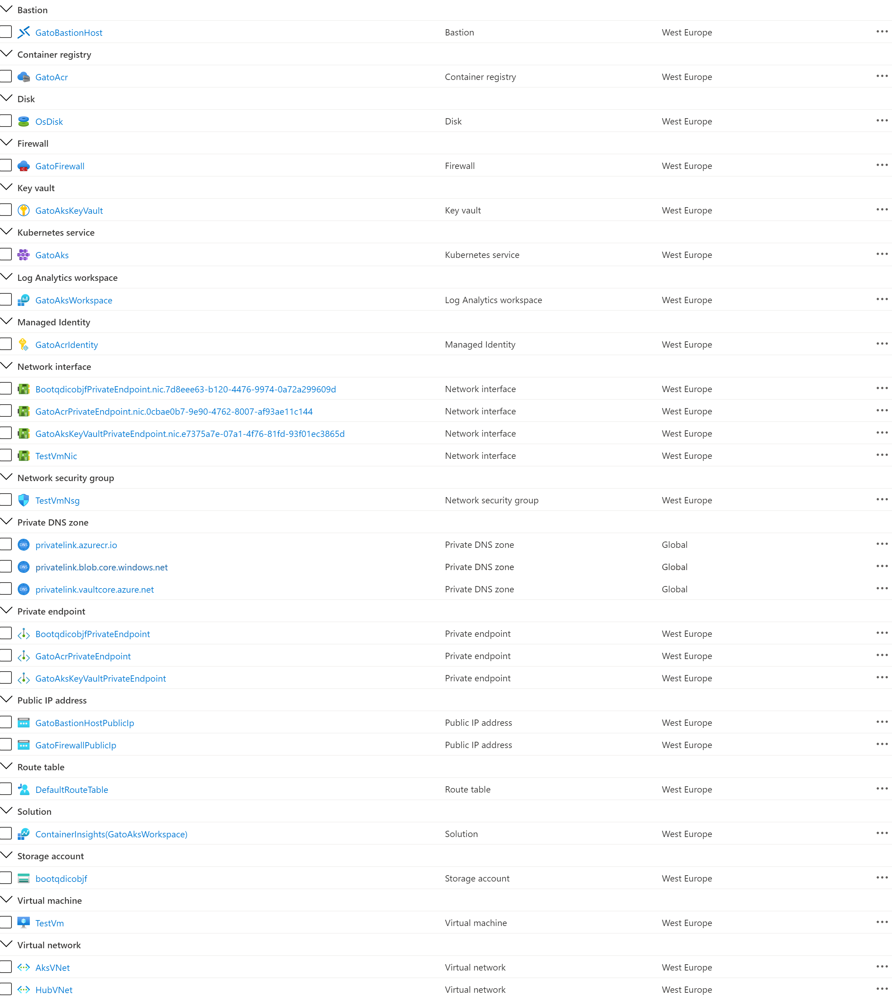
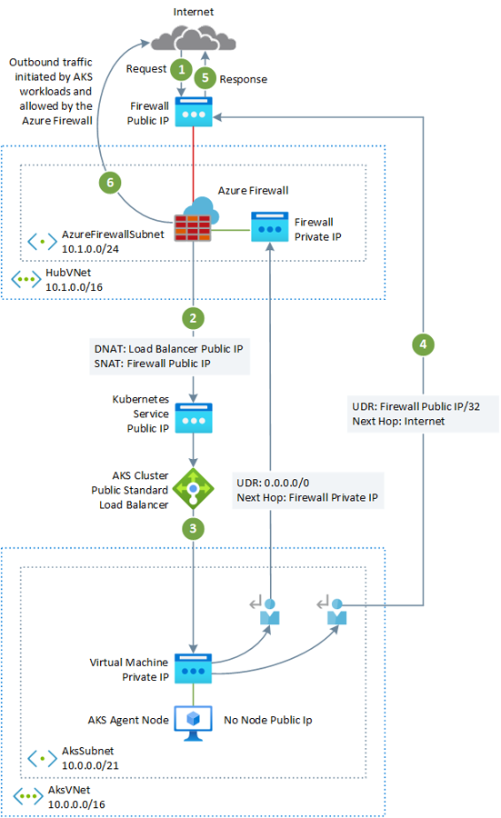
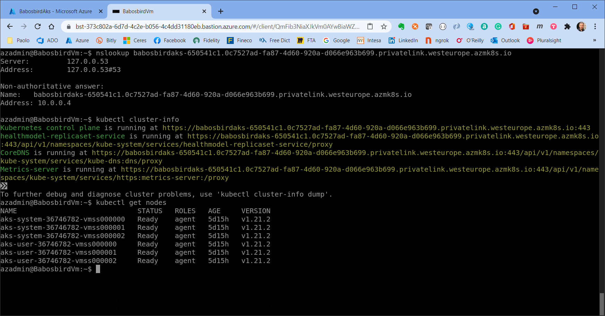

# Create a private Azure Kubernetes Service cluster using Terraform and Azure DevOps #

This sample shows how to create a [private AKS clusters](https://docs.microsoft.com/en-us/azure/aks/private-clusters) using:

- [Terraform](https://www.terraform.io/intro/index.html) as infrastructure as code (IaC) tool to build, change, and version the infrastructure on Azure in a safe, repeatable, and efficient way. 
- [Azure DevOps Pipelines](https://docs.microsoft.com/en-us/azure/devops/pipelines/get-started/what-is-azure-pipelines?view=azure-devops) to automate the deployment and undeployment of the entire infrastructure on multiple environments on the Azure platform.

In a private AKS cluster, the API server endpoint is not exposed via a public IP address. Hence, to manage the API server, you will need to use a virtual machine that has access to the AKS cluster's Azure Virtual Network (VNet). This sample deploys a jumpbox virtual machine in the hub virtual network peered with the virtual network that hosts the private AKS cluster. There are several options for establishing network connectivity to the private cluster.

- Create a virtual machine in the same Azure Virtual Network (VNet) as the AKS cluster.
- Use a virtual machine in a separate network and set up Virtual network peering. See the section below for more information on this option.
- Use an Express Route or VPN connection.

Creating a virtual machine in the same virtual network as the AKS cluster or in a peered virtual network is the easiest option. Express Route and VPNs add costs and require additional networking complexity. Virtual network peering requires you to plan your network CIDR ranges to ensure there are no overlapping ranges. For more information, see [Create a private Azure Kubernetes Service cluster](https://docs.microsoft.com/en-us/azure/aks/private-clusters). For more information on Azure Private Links, see [What is Azure Private Link?](https://docs.microsoft.com/en-us/azure/private-link/private-link-overview)

In addition, the sample creates a private endpoint to access all the managed services deployed by the Terraform modules via a private IP address: 

- Azure Container Registry
- Azure Storage Account
- Azure Key Vault

> **NOTE**  
> If you want to deploy a [private AKS cluster using a public DNS zone](https://docs.microsoft.com/en-us/azure/aks/private-clusters#create-a-private-aks-cluster-with-a-public-dns-address) to simplify the DNS resolution of the API Server to the private IP address of the private endpoint,  you can use this project under my [GitHub](https://github.com/paolosalvatori/private-cluster-with-public-dns-zone) account or on [Azure Quickstart Templates](https://github.com/Azure/azure-quickstart-templates/tree/master/demos/private-aks-cluster-with-public-dns-zone).

## Architecture ##

The following picture shows the high-level architecture created by the Terraform modules included in this sample:

The following picture provides a more detailed view of the infrastructure on Azure.

The architecture is composed of the following elements:

- A hub virtual network with three subnets:
  - AzureBastionSubnet used by Azure Bastion
  - AzureFirewallSubnet used by Azure Firewall
- A new virtual network with three subnets:
  - SystemSubnet used by the AKS system node pool
  - UserSubnet used by the AKS user node pool
  - VmSubnet used by the jumpbox virtual machine and private endpoints
- The private AKS cluster uses a user-defined managed identity to create additional resources like load balancers and managed disks in Azure.
- The private AKS cluster is composed of a:
  - System node pool hosting only critical system pods and services. The worker nodes have node taint which prevents application pods from beings scheduled on this node pool.
  - User node pool hosting user workloads and artifacts.
- An Azure Firewall used to control the egress traffic from the private AKS cluster. For more information on how to lock down your private AKS cluster and filter outbound traffic, see: 
  - [Control egress traffic for cluster nodes in Azure Kubernetes Service (AKS)](https://docs.microsoft.com/en-us/azure/aks/limit-egress-traffic)
  - [Use Azure Firewall to protect Azure Kubernetes Service (AKS) Deployments](https://docs.microsoft.com/en-us/azure/firewall/protect-azure-kubernetes-service)
- An AKS cluster with a private endpoint to the API server hosted by an AKS-managed Azure subscription. The cluster can communicate with the API server exposed via a Private Link Service using a private endpoint.
- An Azure Bastion resource that provides secure and seamless SSH connectivity to the Vm virtual machine directly in the Azure portal over SSL
- An Azure Container Registry (ACR) to build, store, and manage container images and artifacts in a private registry for all types of container deployments.
- When the ACR SKU is equal to Premium, a Private Endpoint is created to allow the private AKS cluster to access ACR via a private IP address. For more information, see [Connect privately to an Azure container registry using Azure Private Link](https://docs.microsoft.com/en-us/azure/container-registry/container-registry-private-link).
- A jumpbox virtual machine used to manage the Azure Kubernetes Service cluster
- A Private DNS Zone for the name resolution of each private endpoint.
- A Virtual Network Link between each Private DNS Zone and both the hub and spoke virtual networks
- A Log Analytics workspace to collect the diagnostics logs and metrics of both the AKS cluster and Vm virtual machine.

## Limitations ##

A private AKS cluster has the following limitations:

- IP authorized ranges can't be applied to the private api server endpoint, they only apply to the public API server
- [Azure Private Link service limitations](https://docs.microsoft.com/en-us/azure/private-link/private-link-service-overview#limitations) apply to private AKS clusters.
- No support for Azure DevOps Microsoft-hosted agents with private clusters. Consider to use [Self-hosted Agents](https://docs.microsoft.com/en-us/azure/devops/pipelines/agents/agents?tabs=browser).
- For customers that need to enable Azure Container Registry to work with private AKS cluster, the Container Registry virtual network must be peered with the agent cluster virtual network.
- No support for converting existing AKS clusters into private clusters
- Deleting or modifying the private endpoint in the customer subnet will cause the cluster to stop functioning.

## Requirements ##

There are some requirements you need to complete before we can deploy Terraform modules using Azure DevOps. 

- Store the Terraform state file to an Azure storage account. For more information on how to create to use a storage account to store remote Terraform state, state locking, and encryption at rest, see [Store Terraform state in Azure Storage](https://docs.microsoft.com/en-us/azure/developer/terraform/store-state-in-azure-storage?tabs=azure-cli)
- Create an Azure DevOps Project. For more information, see [Create a project in Azure DevOps](https://docs.microsoft.com/en-us/azure/devops/organizations/projects/create-project?view=azure-devops&tabs=preview-page)
- Create an [Azure DevOps Service Connection](https://docs.microsoft.com/en-us/azure/devops/pipelines/library/service-endpoints?view=azure-devops&tabs=yaml) to your Azure subscription. No matter you use Service Principal Authentication (SPA) or an Azure-Managed Service Identity when creating the service connection, make sure that the service principal or managed identity used by Azure DevOps to connect to your Azure subscription is assigned the owner role on the entire subscription.

## Fix the routing issue ##

When you deploy an Azure Firewall into a hub virtual network and your private AKS cluster in a spoke virtual network, and you want to use the Azure Firewall to control the egress traffic using network and application rule collections, you need to make sure to properly configure the ingress traffic to any public endpoint exposed by any service running on AKS to enter the system via one of the public IP addresses used by the Azure Firewall. In order to route the traffic of your AKS workloads to the Azure Firewall in the hub virtual network, you need to create and associate a route table to each subnet hosting the worker nodes of your cluster and create a user-defined route to forward the traffic for `0.0.0.0/32` CIDR to the private IP address of the Azure firewall and specify `Virtual appliance` as `next hop type`. For more information, see [Tutorial: Deploy and configure Azure Firewall using the Azure portal](https://docs.microsoft.com/en-us/azure/firewall/tutorial-firewall-deploy-portal#create-a-default-route).

When you introduce an Azure firewall to control the egress traffic from your private AKS cluster, you need to configure the internet traffic to go throught one of the public Ip address associated to the Azure Firewall in front of the Public Standard Load Balancer used by your AKS cluster. This is where the problem occurs. Packets arrive on the firewall's public IP address, but return to the firewall via the private IP address (using the default route). To avoid this problem, create an additional user-defined route for the firewall's public IP address as shown in the picture below. Packets going to the firewall's public IP address are routed via the Internet. This avoids taking the default route to the firewall's private IP address.

For more information, see:

- [Restrict egress traffic from an AKS cluster using Azure firewall](https://docs.microsoft.com/en-us/azure/aks/limit-egress-traffic#restrict-egress-traffic-using-azure-firewall)
- [Integrate Azure Firewall with Azure Standard Load Balancer](https://docs.microsoft.com/en-us/azure/firewall/integrate-lb)

## Terraform State ##

In order to deploy Terraform modules to Azure you can use Azure DevOps CI/CD pipelines. [Azure DevOps](https://docs.microsoft.com/en-us/azure/devops/user-guide/what-is-azure-devops?view=azure-devops) provides developer services for support teams to plan work, collaborate on code development, and build and deploy applications and infrastructure components using IaC technologies such as ARM Templates, Bicep, and Terraform.

Terraform stores [state](https://www.terraform.io/docs/language/state/index.html) about your managed infrastructure and configuration in a special file called state file. This state is used by Terraform to map real-world resources to your configuration, keep track of metadata, and to improve performance for large infrastructures. Terraform state is used to reconcile deployed resources with Terraform configurations. When using Terraform to deploy Azure resources, the state allows Terraform to know what Azure resources to add, update, or delete. By default, Terraform state is stored in a local file named "terraform.tfstate", but it can also be stored remotely, which works better in a team environment. Storing the state in a local file isn't ideal for the following reasons:

- Storing the Terraform state in a local file doesn't work well in a team or collaborative environment.
- Terraform state can include sensitive information.
- Storing state locally increases the chance of inadvertent deletion.

Each Terraform configuration can specify a [backend](https://www.terraform.io/docs/language/settings/backends/index.html), which defines where and how operations are performed, where [state](https://www.terraform.io/docs/language/state/index.html) snapshots are stored. The [Azure Provider](https://registry.terraform.io/providers/hashicorp/azurerm/latest/docs) or **azurerm** can be used to configure infrastructure in Microsoft Azure using the Azure Resource Manager API's. Terraform provides a [backend](https://www.terraform.io/docs/language/settings/backends/azurerm.html) for the Azure Provider that allows to store the state as a Blob with the given Key within a given Blob Container inside a Blob Storage Account. This backend also supports state locking and consistency checking via native capabilities of the Azure Blob Storage.  When using Azure DevOps to deploy services to a cloud environment, you should use this backend to store the state to a remote storage account. For more information on how to create to use a storage account to store remote Terraform state, state locking, and encryption at rest, see [Store Terraform state in Azure Storage](https://docs.microsoft.com/en-us/azure/developer/terraform/store-state-in-azure-storage?tabs=azure-cli). Under the [storage-account](./storage-account) folder in this sample, you can find a Terraform module and bash script to deploy an Azure storage account where you can persist the Terraform state as a blob. 

## Azure DevOps Self-Hosted Agent ##

If you plan to use [Azure DevOps](https://docs.microsoft.com/en-us/azure/devops/?view=azure-devops), you can't use [Azure DevOps Microsoft-hosted agents](https://docs.microsoft.com/en-us/azure/devops/pipelines/agents/agents?view=azure-devops&tabs=browser#microsoft-hosted-agents) to deploy your workloads to a private AKS cluster as they don't have access to its API server. In order to deploy workloads to your private SAKS cluster you need to provision and use an [Azure DevOps self-hosted agent](https://docs.microsoft.com/en-us/azure/devops/pipelines/agents/agents?view=azure-devops&tabs=browser#install) in the same virtual network of your private AKS cluster or in peered virtual network. In this latter case, make sure to the create a virtual network link between the Private DNS Zone of the AKS cluster in the node resource group and the virtual network that hosts the Azure DevOps self-hosted agent. You can deploy a single [Windows](https://docs.microsoft.com/en-us/azure/devops/pipelines/agents/v2-windows?view=azure-devops) or [Linux](https://docs.microsoft.com/en-us/azure/devops/pipelines/agents/v2-linux?view=azure-devops) Azure DevOps agent using a virtual machine, or use a virtual machine scale set (VMWSS). Azure virtual machine scale set agents are a form of self-hosted agents that can be auto-scaled to meet your demands. This elasticity reduces your need to run dedicated agents all the time. Unlike Microsoft-hosted agents, you have flexibility over the size and the image of machines on which agents run. You specify a virtual machine scale set, a number of agents to keep on standby, a maximum number of virtual machines in the scale set, and Azure Pipelines manages the scaling of your agents for you. For more information, see [Azure virtual machine scale set agents](https://docs.microsoft.com/en-us/azure/devops/pipelines/agents/scale-set-agents?view=azure-devops). As an alternative, you can set up a self-hosted agent in Azure Pipelines to run inside a Windows Server Core (for Windows hosts), or Ubuntu container (for Linux hosts) with Docker and deploy it as a pod with one or multiple replicas in your private AKS cluster.
In this case, if the subnets hosting the node pools of your private AKS cluster are configured to route the egress traffic to an Azure Firewall via a route table and user-defined route, make sure to create the proper application and network rules to allow the agent to access external sites to download and install tools like [Docker](https://www.docker.com/), [kubectl](https://kubectl.docs.kubernetes.io/guides/introduction/kubectl/), [Azure CLI](https://docs.microsoft.com/en-us/cli/azure/install-azure-cli), and [Helm](https://helm.sh/) to the agent virtual machine. For more informations, see [Run a self-hosted agent in Docker](https://docs.microsoft.com/en-us/azure/devops/pipelines/agents/docker?view=azure-devops) and [Build and deploy Azure DevOps Pipeline Agent on AKS](https://github.com/ganrad/Az-DevOps-Agent-On-AKS). The [cd-self-hosted-agent](./pipelines/cd-self-hosted-agent.yml) pipeline in this sample deploys a [self-hosted Linux agent](https://docs.microsoft.com/en-us/azure/devops/pipelines/agents/v2-linux?view=azure-devops) as an Ubuntu Linux virtual machine in the same virtual network hosting the private AKS cluster. The pipeline uses a Terraform module under the [agent](./agent) folder to deploy the virtual machine. Make sure to specify values for the variables in the [cd-self-hosted-agent](./pipelines/cd-self-hosted-agent.yml) and in the [agent.tfvars](./tfvars/agent/agent.tfvars). The following picture represents the network topology of Azure DevOps and self-hosted agent.

## Variable Groups ##

The [key-vault](./key-vault) folder contains a bash script that uses Azure CLI to store the following data to an Azure Key Vault. This sensitive data will be used by Azure DevOps CD pipelines via [variable groups](https://docs.microsoft.com/en-us/azure/devops/pipelines/library/variable-groups?view=azure-devops&tabs=yaml). Variable groups store values and secrets that you want to pass into a YAML pipeline or make available across multiple pipelines. You can share use variables groups in multiple pipelines in the same project. You can Link an existing Azure key vault to a variable group and map selective vault secrets to the variable group. You can link an existing Azure Key Vault to a variable group and select which secrets you want to expose as variables in the variable group. For more information, see [Link secrets from an Azure Key Vault](https://docs.microsoft.com/en-us/azure/devops/pipelines/library/variable-groups?view=azure-devops&tabs=yaml#link-secrets-from-an-azure-key-vault).

The YAML pipelines in this sample use a variable group shown in the following picture:

The variable group is configured to use the following secrets from an existing Key Vault:

| Variable |Description | 
| :--- | :--- |
| terraformBackendContainerName | Name of the blob container holding the Terraform remote state |
| terraformBackendResourceGroupName | Resource group name of the storage account that contains the Terraform remote state  |
| terraformBackendStorageAccountKey | Key of the storage account that contains the Terraform remote state  |
| terraformBackendStorageAccountName | Name of the storage account that contains the Terraform remote state  |
| sshPublicKey | Key used by Terraform to configure the SSH public key for the administrator user of the virtual machine and AKS worker nodes  |
| azureDevOpsUrl | Url of your Azure DevOps Organization (e.g. https://dev.azure.com/contoso) |
| azureDevOpsPat | Personal access token used by an Azure DevOps self-hosted agent |
| azureDevOpsAgentPoolName | Name of the agent pool of the Azure DevOps self-hosted agent |

## Azure DevOps Pipelines ##

You can use Azure DevOps YAML pipelines to deploy resources to the target environment. Pipelines are part of the same Git repo that contains the artifacts such as Terraform modules and scripts and as such pipelines can be versioned as any other file in the Git reppsitory. You can follow a pull-request process to ensure changes are verified and approved before being merged. The following picture shows the key concepts of an Azure DevOps pipeline.

- A [trigger](https://docs.microsoft.com/en-us/azure/devops/pipelines/get-started/key-pipelines-concepts?view=azure-devops#trigger) tells a Pipeline to run.
- A [pipeline](https://docs.microsoft.com/en-us/azure/devops/pipelines/get-started/key-pipelines-concepts?view=azure-devops#pipeline) is made up of one or more [stages](https://docs.microsoft.com/en-us/azure/devops/pipelines/get-started/key-pipelines-concepts?view=azure-devops#stage). A [pipeline](https://docs.microsoft.com/en-us/azure/devops/pipelines/get-started/key-pipelines-concepts?view=azure-devops#pipeline) can deploy to one or more [environments](https://docs.microsoft.com/en-us/azure/devops/pipelines/get-started/key-pipelines-concepts?view=azure-devops#environment).
- A [stage](https://docs.microsoft.com/en-us/azure/devops/pipelines/get-started/key-pipelines-concepts?view=azure-devops#stage) is a way of organizing [jobs](https://docs.microsoft.com/en-us/azure/devops/pipelines/get-started/key-pipelines-concepts?view=azure-devops#job) in a pipeline and each stage can have one or more jobs.
- Each [job](https://docs.microsoft.com/en-us/azure/devops/pipelines/get-started/key-pipelines-concepts?view=azure-devops#job) runs on one [agent](https://docs.microsoft.com/en-us/azure/devops/pipelines/get-started/key-pipelines-concepts?view=azure-devops#agent). A job can also be agentless.
- Each [agent](https://docs.microsoft.com/en-us/azure/devops/pipelines/get-started/key-pipelines-concepts?view=azure-devops#agent) runs a job that contains one or more [steps](https://docs.microsoft.com/en-us/azure/devops/pipelines/get-started/key-pipelines-concepts?view=azure-devops#step).
- A [step](https://docs.microsoft.com/en-us/azure/devops/pipelines/get-started/key-pipelines-concepts?view=azure-devops#step) can be a [task](https://docs.microsoft.com/en-us/azure/devops/pipelines/get-started/key-pipelines-concepts?view=azure-devops#task) or [script](https://docs.microsoft.com/en-us/azure/devops/pipelines/get-started/key-pipelines-concepts?view=azure-devops#script) and is the smallest building block of a pipeline.
- A [task](https://docs.microsoft.com/en-us/azure/devops/pipelines/get-started/key-pipelines-concepts?view=azure-devops#task) is a pre-packaged script that performs an action, such as invoking a REST API or publishing a build artifact.
- An [artifact](https://docs.microsoft.com/en-us/azure/devops/pipelines/get-started/key-pipelines-concepts?view=azure-devops#artifact) is a collection of files or packages published by a run.

For more information on Azure DevOps pipelines, see: 

- [What is Azure Pipelines?](https://docs.microsoft.com/en-us/azure/devops/pipelines/get-started/what-is-azure-pipelines?view=azure-devops#:~:text=Azure%20Pipelines%20automatically%20builds%20and,ship%20it%20to%20any%20target.)
- [Add stages, dependencies, & conditions](https://docs.microsoft.com/en-us/azure/devops/pipelines/process/stages?view=azure-devops&tabs=yaml)
- [Specify jobs in your pipeline](https://docs.microsoft.com/en-us/azure/devops/pipelines/process/phases?view=azure-devops&tabs=yaml)

This sample provides three pipelines to deploy the infrastructure using Terraform modules, and one to undeploy the infrastructure. 

| Pipeline Name | Description |
| :--- | :--- |
| [cd-validate-plan-apply-one-stage-tfvars](./pipelines/cd-validate-plan-apply-one-stage-tfvars.yml) | In Terraform, to set a large number of variables, you can specify their values in a variable definitions file (with a filename ending in either `.tfvars` or `.tfvars.json`) and then specify that file on the command line with a `-var-file` parameter. For more information, see [Input Variables](https://www.terraform.io/docs/language/values/variables.html). The sample contains three different `.tfvars` files under the [tfvars](./tfvars) folder. Each file contains a different value for each variable and can be used to deploy the same infrastructure to three distinct environment: production, staging, and test. |
| [cd-validate-plan-apply-one-stage-vars](./pipelines/cd-validate-plan-apply-one-stage-vars.yml) | This pipeline specifies variable values for Terraform [plan](https://www.terraform.io/docs/cli/commands/plan.html) and [apply](https://www.terraform.io/docs/cli/commands/apply.html) commands with the `-var` command line option. For more information, see [Input Variables](https://www.terraform.io/docs/language/values/variables.html). |
| [cd-validate-plan-apply-separate-stages.yml](./pipelines/cd-validate-plan-apply-separate-stages.yml) | This pipeline is composed of three distinct stages for [validate](https://www.terraform.io/docs/cli/commands/validate.html), [plan](https://www.terraform.io/docs/cli/commands/plan.html), and [apply](https://www.terraform.io/docs/cli/commands/apply.html). Each stage can be run separately. |
| [destroy-aks-deployment](./pipelines/destroy-aks-deployment.yml) | This pipeline uses the [destroy](https://www.terraform.io/docs/cli/commands/destroy.html) command to fully remove the resource group and all the Azure resources. |
| [cd-self-hosted-agent.](./pipelines/cd-self-hosted-agent.yml) | This pipeline can be used to deploy an [Azure DevOps self-hosted agent](https://docs.microsoft.com/en-us/azure/devops/pipelines/agents/v2-linux?view=azure-devops) as an Ubuntu virtual machine in the same subnet of the jump-box virtual machine. This deployment requires you to pass as a paramater the following information: <ul><li>Url of your Azure DevOps Organization</li><li>Personal access token to access your Azure DevOps organization</li><li>Name of the self-hosted agent pool to join</li></ul>This pipeline must be executed after the AKS deployment. |
| [cd-redmine-via-helm](./pipelines/cd-redmine-via-helm.yml) | This pipeline can be used to deploy the Bitnami [redmine](https://artifacthub.io/packages/helm/bitnami/redmine) project management web application using a Helm chart from [ArtifactHub](https://artifacthub.io). This pipeline creates all the necessary Azure resources to front the Public IP of the Standard Load Balancer used by the service with the Azure Firewall in the Hub virtual network and expose the service with a hostname defined in an Azure public DNS zone. For more information, see: <ul><li>[Control egress traffic for cluster nodes in Azure Kubernetes Service (AKS)](https://docs.microsoft.com/en-us/azure/aks/limit-egress-traffic)</li><li>[Integrate Azure Firewall with Azure Standard Load Balancer](https://docs.microsoft.com/en-us/azure/firewall/integrate-lb)</li></ul> |
| [destroy-self-hosted-agent](./pipelines/destroy-self-hosted-agent.yml) | This pipeline can be used to destroy the Azure DevOps self-hosted agent. |
| [destroy-redmine-via-helm](./pipelines/destroy-redmine-via-helm.yml) | This pipeline can be used to uninstall the Bitnami [redmine](https://artifacthub.io/packages/helm/bitnami/redmine) project management we application using a Helm chart and destroy all the Azure resources used to exposed the service via the Azure Firewall and the AKS cluster Standard Load Balancer. |
| [ci-test-web-app](./pipelines/ci-test-web-app.yml) | This pipeline can be used to build the container image of the [test web application](./source) and store it to an Azure Container Registry. In addition, the pipeline stores the [Helm chart](./chart) to another repository inside the registry. |
| [cd-test-web-app](./pipelines/cd-test-web-app.yml) | This pipeline can be used to deploy the [test web application](./source) using a Helm chart. This pipeline creates all the necessary Azure resources to front the Public IP of the Standard Load Balancer used by the service with the Azure Firewall in the Hub virtual network and expose the service with a hostname defined in an Azure public DNS zone. For more information, see: <ul><li>[Control egress traffic for cluster nodes in Azure Kubernetes Service (AKS)](https://docs.microsoft.com/en-us/azure/aks/limit-egress-traffic)</li><li>[Integrate Azure Firewall with Azure Standard Load Balancer](https://docs.microsoft.com/en-us/azure/firewall/integrate-lb)</li></ul> |

## Terraform Extension for Azure DevOps ##

All the pipelines make use of the tasks of the [Terraform](https://marketplace.visualstudio.com/items?itemName=ms-devlabs.custom-terraform-tasks) extension. This extension provides the following components:

- A service connection for connecting to an Amazon Web Services(AWS) account
- A service connection for connecting to a Google Cloud Platform(GCP) account
- A task for installing a specific version of Terraform, if not already installed, on the agent
- A task for executing the core Terraform commands

The Terraform tool installer task acquires a specified version of [Terraform](https://www.terraform.io/) from the Internet or the tools cache and prepends it to the PATH of the Azure Pipelines Agent (hosted or private). This task can be used to change the version of Terraform used in subsequent tasks. Adding this task before the [Terraform task](https://github.com/microsoft/azure-pipelines-extensions/tree/master/Extensions/Terraform/Src/Tasks/TerraformTask/TerraformTaskV2) in a build definition ensures you are using that task with the right Terraform version.

The [Terraform task](https://github.com/microsoft/azure-pipelines-extensions/tree/master/Extensions/Terraform/Src/Tasks/TerraformTask/TerraformTaskV2) enables running Terraform commands as part of Azure Build and Release Pipelines providing support for the following Terraform commands

- [init](https://www.terraform.io/docs/cli/commands/init.html)
- [validate](https://www.terraform.io/docs/cli/commands/validate.html)
- [plan](https://www.terraform.io/docs/cli/commands/plan.html)
- [apply](https://www.terraform.io/docs/cli/commands/apply.html)
- [destroy](https://www.terraform.io/docs/cli/commands/destroy.html)

This extension is intended to run on Windows, Linux and MacOS agents. As an alternative, you can use the [Bash Task](https://docs.microsoft.com/en-us/azure/devops/pipelines/tasks/utility/bash?
view=azure-devops) or [PowerShell Task](https://docs.microsoft.com/en-us/azure/devops/pipelines/tasks/utility/powershell?view=azure-devops) to install Terraform to the agent and run Terraform commands.

## Azure Resources ##

The following picture shows the resources deployed by the ARM template in the target resource group using one of the Azure DevOps pipelines in this reporitory.

The following picture shows the resources deployed by the ARM template in the MC resource group associated to the AKS cluster:

## Use Azure Firewall in front of the Public Standard Load Balancer of the AKS cluster ##

The resource definiton in the Terraform modules make use of the [lifecycle](https://www.terraform.io/docs/language/meta-arguments/lifecycle.html) meta-argument to customize the actions when Azure resources get changed changes outside of Terraform control. The [ignore_changes](https://www.terraform.io/docs/language/meta-arguments/lifecycle.html#ignore_changes) argument is used to instruct Terraform to ignore updates to given resource properties such as tags. The Azure Firewall Policy resource definition contains a lifecycle block to prevent Terraform to fix the resource when a rule collection or a single rule gets created, updated, or deleted. Likewise, the Azure Route Table contains a a lifecycle block to prevent Terraform to fix the resource when a user-defined route gets created, deleted, or updated. This allows to manage the DNAT, Application, and Network rules of an Azure Firewall Policy and the user-defined routes of an Azure Route Table outside of Terraform control.

The [cd-redmine-via-helm](./pipelines/cd-redmine-via-helm.yml) pipeline shows how you can deploy a workload to a private AKS cluster using an [Azure DevOps Pipelines](https://docs.microsoft.com/en-us/azure/devops/pipelines/get-started/what-is-azure-pipelines?view=azure-devops) that runs on a [Self-hosted Agent](https://docs.microsoft.com/en-us/azure/devops/pipelines/agents/agents?tabs=browser). The sample deploys the Bitnami [redmine](https://artifacthub.io/packages/helm/bitnami/redmine) project management web application using a public [Helm](https://helm.sh/) chart. The following diagram shows the network topology of the sample:

The message flow can be described as follows:

1. A request for the AKS-hosted web application is sent to a public IP exposed by the Azure Firewall via a public IP configuration. Both the public IP and public IP configuration are dedicated to this workload.
2. An [Azure Firewall DNAT rule](https://docs.microsoft.com/en-us/azure/firewall/tutorial-firewall-dnat) is used to to translate the Azure Firewall public IP address and port to the public IP and port used by the workload in the `kubernetes` public Standard Load Balancer of the AKS cluster in the node resource group.
3. The request is sent by the load balancer to one of the Kubernetes service pods running on one of the agent nodes of the AKS cluster.
4. The response message is sent back to the original caller via a user-defined with the Azure Firewall public IP as address prefix and Internet as next hope type.
5. Any workload-initiated outbound call is routed to the private IP address of the Azure Firewall by the default user-defined route with `0.0.0.0/0` as address prefix and virtual appliance as next hope type.

The [cd-redmine-via-helm](./pipelines/cd-redmine-via-helm.yml) pipeline performs the following steps:

- The [Helm Installer](https://docs.microsoft.com/en-us/azure/devops/pipelines/tasks/tool/helm-installer?view=azure-devops) task installs [Helm](https://helm.sh/) on the [Self-hosted Agent](https://docs.microsoft.com/en-us/azure/devops/pipelines/agents/agents?tabs=browser): this step is not necessary if [Helm](https://helm.sh/) is already installed on the agent
- The [Kubectl Installer](https://docs.microsoft.com/en-us/azure/devops/pipelines/tasks/tool/kubectl-installer?view=azure-devops) taks installs [kubectl](https://kubectl.docs.kubernetes.io/guides/introduction/kubectl/) on the self-hosted agent: even this step is not necessary if [kubectl](https://kubectl.docs.kubernetes.io/guides/introduction/kubectl/) is already installed on the agent
- Uses the [Azure CLI](https://docs.microsoft.com/en-us/azure/devops/pipelines/tasks/deploy/azure-cli?view=azure-devops) task to run the following steps:
  - Gets the AKS cluster credentials using the [az aks get-credentials](https://docs.microsoft.com/en-us/cli/azure/aks?view=azure-cli-latest#az_aks_get_credentials) command
  - Uses the [Helm](https://helm.sh/) CLI to add the repo for the Bitnami [redmine](https://artifacthub.io/packages/helm/bitnami/redmine) project management web application
  - Uses [Helm](https://helm.sh/) CLI to check if the Helm chart is already deployed:
    - If yes, it upgrades the current release.
    - If not, it installs a new release.
  - Uses [kubectl](https://kubectl.docs.kubernetes.io/guides/introduction/kubectl/) to retrieve the Public IP of the redmine service.
  - Uses the [az network public-ip show](https://docs.microsoft.com/en-us/cli/azure/network/public-ip?view=azure-cli-latest#az_network_public_ip_show) to check if an Azure Public IP resource called `AksName_HelmReleaseNamespace_ServiceName` already exists in a give resource group.
    - If yes, it retrieves its public IP address.
    - If not, it creates a new Azure Public IP resource using the [az network public-ip create](https://docs.microsoft.com/en-us/cli/azure/network/public-ip?view=azure-cli-latest#az_network_public_ip_create) and retrieves its public IP address.
  - Uses the [az network firewall ip-config show](https://docs.microsoft.com/en-us/cli/azure/network/firewall/ip-config?view=azure-cli-latest#az_network_firewall_ip_config_show) command to check if an Azure Firewall IP configuration named `AksName_HelmReleaseNamespace_ServiceName` already exists. If not, it creates a new Azure Firewall IP configuration using the [az network firewall ip-config create](https://docs.microsoft.com/en-us/cli/azure/network/firewall/ip-config?view=azure-cli-latest#az_network_firewall_ip_config_create) command.
  - Uses the [az network firewall policy rule-collection-group collection list](https://docs.microsoft.com/en-us/cli/azure/network/firewall/policy/rule-collection-group/collection?view=azure-cli-latest#az_network_firewall_policy_rule_collection_group_collection_list) command to check if a DNAT rule collection named `DnatRules` already exists in the Azure Firewall Policy. If not, it creates a new a DNAT rule collection named `DnatRules` under the `DefaultDnatRuleCollectionGroup` rule collection group using the [az network firewall policy rule-collection-group collection add-filter-collection](https://docs.microsoft.com/en-us/cli/azure/network/firewall/policy/rule-collection-group/collection?view=azure-cli-latest#az_network_firewall_policy_rule_collection_group_collection_add_filter_collection) command.
  - Uses the [az network firewall policy rule-collection-group collection rule add](https://docs.microsoft.com/en-us/cli/azure/network/firewall/policy/rule-collection-group/collection/rule?view=azure-cli-latest#az_network_firewall_policy_rule_collection_group_collection_rule_add) command to add a DNAT rule to the Azure Firewall Policy that maps the port 80 of the `AksName_HelmReleaseNamespace_ServiceName` public IP address used by the `AksName_HelmReleaseNamespace_ServiceName` Azure Firewall IP configuration to the port 80 of the public IP address exposed by the redmine service on the Standard Load Balancer of the private AKS cluster (in a production environment you should use port 443 and HTTPS transport protocol instead of port 80 and unsecure HTTP transport protocol).
  - Uses the [az network route-table route show](https://docs.microsoft.com/en-us/cli/azure/network/route-table/route?view=azure-cli-latest#az_network_route_table_route_show) command to check if a user-defined route called exists in the Azure Route Table associated to the subnets hosting the node pools of the AKS cluster. If not, it creates a new user-defined route using the [az network route-table route create](https://docs.microsoft.com/en-us/cli/azure/network/route-table/route?view=azure-cli-latest#az_network_route_table_route_create) command thats routes the traffic from the public IP address named `AksName_HelmReleaseNamespace_ServiceName` directly to internet. This route is more specific than the user-defined route with CIDR `0.0.0.0/0` that routes the traffic from the subnets hosting AKS node pools to the private IP address of the Azure Firewall. This user-defined rule allows to properly send back response messages to the public IP address of the Azure Firewall Ip configuration used to expose the redmine Kubernetes service.
  - Uses the [az network dns record-set a list](https://docs.microsoft.com/en-us/cli/azure/network/dns/record-set/a?view=azure-cli-latest#az_network_dns_record_set_a_list) command to check if an A record exists with the given subdomain for the AKS-hosted web application. If not, the pipeline uses the [az network dns record-set a add-record](https://docs.microsoft.com/en-us/cli/azure/network/dns/record-set/a?view=azure-cli-latest#az_network_dns_record_set_a_add_record) command to an A record for the resolution of the service hostname to the public IP address of the Azure Firewall public IP.

Likewise, the [destroy-redmine-via-helm](./pipelines/destroy-redmine-via-helm.yml) pipeline shows how you can undeploy a workload to a private AKS cluster using an [Azure DevOps Pipelines](https://docs.microsoft.com/en-us/azure/devops/pipelines/get-started/what-is-azure-pipelines?view=azure-devops) that runs on a [Self-hosted Agent](https://docs.microsoft.com/en-us/azure/devops/pipelines/agents/agents?tabs=browser). The pipeline performs the following steps:

- The [Helm Installer](https://docs.microsoft.com/en-us/azure/devops/pipelines/tasks/tool/helm-installer?view=azure-devops) task installs [Helm](https://helm.sh/) on the [Self-hosted Agent](https://docs.microsoft.com/en-us/azure/devops/pipelines/agents/agents?tabs=browser): this step is not necessary if [Helm](https://helm.sh/) is already installed on the agent
- The [Kubectl Installer](https://docs.microsoft.com/en-us/azure/devops/pipelines/tasks/tool/kubectl-installer?view=azure-devops) taks installs [kubectl](https://kubectl.docs.kubernetes.io/guides/introduction/kubectl/) on the self-hosted agent: even this step is not necessary if [kubectl](https://kubectl.docs.kubernetes.io/guides/introduction/kubectl/) is already installed on the agent
- Uses the [Azure CLI](https://docs.microsoft.com/en-us/azure/devops/pipelines/tasks/deploy/azure-cli?view=azure-devops) task to run the following steps:
  - Gets the AKS cluster credentials using the [az aks get-credentials](https://docs.microsoft.com/en-us/cli/azure/aks?view=azure-cli-latest#az_aks_get_credentials) command
  - Uses [Helm](https://helm.sh/) CLI to uninstall the redmine release.
  - Uses [kubectl](https://kubectl.docs.kubernetes.io/guides/introduction/kubectl/) to delete the Kubernetes namespace used by the release.
  - Uses the [az network firewall policy rule-collection-group collection rule remove](https://docs.microsoft.com/en-us/cli/azure/network/firewall/policy/rule-collection-group/collection/rule?view=azure-cli-latest#az_network_firewall_policy_rule_collection_group_collection_rule_remove) command to remove the DNAT rule called `AksName_HelmReleaseNamespace_ServiceName` from the `DnatRules` rule collection of the Azure Firewall Policy.

  - Uses the [az network route-table route delete](https://docs.microsoft.com/en-us/cli/azure/network/route-table/route?view=azure-cli-latest#az_network_route_table_route_delete) command to delete the user-defined route called `AksName_HelmReleaseNamespace_ServiceName` from the Azure Route Table associated to the subnets hosting the node pools of the AKDS cluster.
  - Uses the [az network firewall ip-config delete](https://docs.microsoft.com/en-us/cli/azure/network/firewall/ip-config?view=azure-cli-latest#az_network_firewall_ip_config_delete) command to delete the Azure Firewall IP configuration called `AksName_HelmReleaseNamespace_ServiceName` used to expose the redmine Kubernetes service.
  - Uses the [az network public-ip delete](https://docs.microsoft.com/en-us/cli/azure/network/public-ip?view=azure-cli-latest#az_network_public_ip_delete) command to destroy the Azure Public IP called `AksName_HelmReleaseNamespace_ServiceName` used to expose the redmine Kubernetes service.

## API Gateway ##

In a production environment where Azure Firewall is used to inspect, protect, and filter inbound internet traffic with [Azure Firewall DNAT rules](https://docs.microsoft.com/en-us/azure/firewall/tutorial-firewall-dnat) and [Threat intelligence-based filtering](https://docs.microsoft.com/en-us/azure/firewall/threat-intel), it's a good practice to use an API Gateway to expose web applications and REST APIs to the public internet.

Without an API gateway, client apps should send requests directly to the Kubernetes-hosted microservices and this would raises the following problems:

- **Coupling**: client application are coupled to internal microservices. Refactoring internal microservices can cause breaking changes to the client apps. Introducing a level of indirection via an API Gateway between client apps and a SaaS application allows you to start breaking down the monolith and gradually replace subsystems  with microservices without violating the contract with client apps.
- **Chattiness**: if a single page/screen needs to retrieve data from multiple microservices, this can result into multiple calls to fine-grained microservices
- **Security issues**:  without an API Gateway, all the microservices are directly exposed to the public internet making the attack surface larger.
- **Cross-cutting concerns**: Each publicly exposed microservice must implement concerns such as authentication, authorization, SSL termination, client rate limiting, response caching, etc.

When running applications on AKS, you can use one of the following API Gateways:

- **Reverse Proxy Server**: [Nginx](https://www.nginx.com/), [HAProxy](https://www.haproxy.com/), and [Traefik](https://traefik.io/) are popular reverse proxy servers that support features such as load balancing, SSL termination, and layer 7 routing. They can run on dedicated virtual machines or as ingress controllers on a Kubernetes cluster.
- **Service Mesh Ingress Controller**: If you are using a service mesh such as [Open Service Mesh](https://openservicemesh.io/), [Linkerd](https://linkerd.io/), and [Istio](https://istio.io/), consider the features that are provided by the ingress controller for that service mesh. For example, the Istio ingress controller supports layer 7 routing, HTTP redirects, retries, and other features.
- **Azure Application Gateway**: [Azure Application Gateway](https://docs.microsoft.com/en-us/azure/application-gateway/overview) is a regional, fully-managed load balancing service that can perform layer-7 routing and SSL termination. It also provides a Web Access Firewall and an [ingress controller](https://docs.microsoft.com/en-us/azure/application-gateway/ingress-controller-overview) for Kubernetes. For more information, see [Use Application Gateway Ingress Controller (AGIC) with a multi-tenant Azure Kubernetes Service](https://docs.microsoft.com/en-us/azure/architecture/example-scenario/aks-agic/aks-agic).
- **Azure Front Door**:  [Azure Front Door](https://docs.microsoft.com/en-us/azure/frontdoor/front-door-overview) is a global layer 7 load balancer that uses the Microsoft global edge network to create fast, secure, and widely scalable web applications. It supports features such as SSL termination, response caching, WAF at the edge, URL-based routing, rewrite and redirections, it support multiple routing methods such as priority routing and latency-based routing.
- **Azure API Management**: [API Management](https://docs.microsoft.com/en-us/azure/api-management/api-management-key-concepts) is a turnkey solution for publishing APIs to both external and internal customers. It provides features that are useful for managing a public-facing API, including rate limiting, IP restrictions, and authentication and authorization using Azure Active Directory or other identity providers.

## Use Azure Firewall in front of an internal Standard Load Balancer ##

In this scenario, an ASP.NET Core application is hosted as a service by an Azure Kubernetes Service cluster and fronted by an [NGINX ingress controller](https://kubernetes.github.io/ingress-nginx/). The application code is available under the [source](./source) folder, while the Helm chart is available in the [chart](./chart) folder. The [NGINX ingress controller](https://kubernetes.github.io/ingress-nginx/) is exposed via an internal load balancer with a private  IP address in the spoke virtual network that hosts the AKS cluster. For more information, see [Create an ingress controller to an internal virtual network in Azure Kubernetes Service (AKS)](https://docs.microsoft.com/en-us/azure/aks/ingress-internal-ip). When you deploy an NGINX ingress controller or more in general a `LoadBalancer` or `ClusterIP` service with the `service.beta.kubernetes.io/azure-load-balancer-internal: "true"` annotation in the metadata section, an internal standard load balancer called `kubernetes-internal` gets created under the node resource group. For more information, see [Use an internal load balancer with Azure Kubernetes Service (AKS)](https://docs.microsoft.com/en-us/azure/aks/internal-lb). As shown in the picture below, the test web application is exposed via the Azure Firewall using a dedicated Azure public IP.  

The message flow can be described as follows:

1. A request for the AKS-hosted test web application is sent to a public IP exposed by the Azure Firewall via a public IP configuration. Both the public IP and public IP configuration are dedicated to this workload.
2. An [Azure Firewall DNAT rule](https://docs.microsoft.com/en-us/azure/firewall/tutorial-firewall-dnat) is used to to translate the Azure Firewall public IP address and port to the private IP address and port used by the NGINX ingress conroller in the internal Standard Load Balancer of the AKS cluster in the node resource group.
3. The request is sent by the internal load balancer to one of the Kubernetes service pods running on one of the agent nodes of the AKS cluster.
4. The response message is sent back to the original caller via a user-defined with `0.0.0.0/0` as address prefix and virtual appliance as next hope type.
5. Any workload-initiated outbound call is routed to the private IP address of the user-defined route.

The [ci-test-web-app](./pipelines/ci-test-web-app.yml) pipeline performs the following steps:

- Uses the [az acr login](https://docs.microsoft.com/en-us/cli/azure/acr?view=azure-cli-latest#az_acr_login) command to login to Azure Container Registry through the Docker CLI.
- Uses `docker build` and `docker push` commands to build and publish the container image to Azure Container Registry.
- Uses `helm registry login` to login to Azure Container Registry via Helm
- Uses `helm push` command to push the Helm chart as an [Open Container Initiative (OCI)](https://opencontainers.org/) artifact.

The [cd-test-web-app](./pipelines/cd-test-web-app.yml) pipeline performs the following steps:

- The [Helm Installer](https://docs.microsoft.com/en-us/azure/devops/pipelines/tasks/tool/helm-installer?view=azure-devops) task installs [Helm](https://helm.sh/) on the [Self-hosted Agent](https://docs.microsoft.com/en-us/azure/devops/pipelines/agents/agents?tabs=browser): this step is not necessary if [Helm](https://helm.sh/) is already installed on the agent
- The [Kubectl Installer](https://docs.microsoft.com/en-us/azure/devops/pipelines/tasks/tool/kubectl-installer?view=azure-devops) taks installs [kubectl](https://kubectl.docs.kubernetes.io/guides/introduction/kubectl/) on the self-hosted agent: even this step is not necessary if [kubectl](https://kubectl.docs.kubernetes.io/guides/introduction/kubectl/) is already installed on the agent
- Uses the [Azure CLI](https://docs.microsoft.com/en-us/azure/devops/pipelines/tasks/deploy/azure-cli?view=azure-devops) task to run the following steps:
  - Gets the AKS cluster credentials using the [az aks get-credentials](https://docs.microsoft.com/en-us/cli/azure/aks?view=azure-cli-latest#az_aks_get_credentials) command
  - Uses the [Helm](https://helm.sh/) CLI to add the repo for the Bitnami [redmine](https://artifacthub.io/packages/helm/bitnami/redmine) project management web application
  - Uses [Helm](https://helm.sh/) CLI to check if the Helm chart is already deployed:
    - If yes, it upgrades the current release.
    - If not, it installs a new release.
  - Deploys the [cert-manager](https://cert-manager.io/docs/) via Helm chart. Cert-manager adds certificates and certificate issuers as resource types in Kubernetes clusters, and simplifies the process of obtaining, renewing and using those certificates. In this sample, cert-manager issues a certificate from [Let's Encrypt](https://letsencrypt.org/) used by the NGINX ingress controller for SSL termination.
  - Deploys the [NGINX ingress controller](https://kubernetes.github.io/ingress-nginx/) via Helm chart. The [NGINX ingress controller](https://kubernetes.github.io/ingress-nginx/) is exposed via an internal load balancer with a private IP address in the spoke virtual network that hosts the AKS cluster. For more information, see [Create an ingress controller to an internal virtual network in Azure Kubernetes Service (AKS)](https://docs.microsoft.com/en-us/azure/aks/ingress-internal-ip). When you deploy an NGINX ingress controller or more in general a `LoadBalancer` or `ClusterIP` service with the `service.beta.kubernetes.io/azure-load-balancer-internal: "true"` annotation in the metadata section, an internal standard load balancer called `kubernetes-internal` gets created under the node resource group. For more information, see [Use an internal load balancer with Azure Kubernetes Service (AKS)](https://docs.microsoft.com/en-us/azure/aks/internal-lb).
  - Uses [kubectl](https://kubectl.docs.kubernetes.io/guides/introduction/kubectl/) to retrieve the external, private IP of the NGINX ingress controller.
  - Uses the [az network public-ip show](https://docs.microsoft.com/en-us/cli/azure/network/public-ip?view=azure-cli-latest#az_network_public_ip_show) to check if an Azure Public IP resource called `AksName_HelmReleaseNamespace_ServiceName` already exists in a give resource group.
    - If yes, it retrieves its public IP address.
    - If not, it creates a new Azure Public IP resource using the [az network public-ip create](https://docs.microsoft.com/en-us/cli/azure/network/public-ip?view=azure-cli-latest#az_network_public_ip_create) and retrieves its public IP address.
  - Uses the [az network firewall ip-config show](https://docs.microsoft.com/en-us/cli/azure/network/firewall/ip-config?view=azure-cli-latest#az_network_firewall_ip_config_show) command to check if an Azure Firewall IP configuration named `AksName_HelmReleaseNamespace_ServiceName` already exists. If not, it creates a new Azure Firewall IP configuration using the [az network firewall ip-config create](https://docs.microsoft.com/en-us/cli/azure/network/firewall/ip-config?view=azure-cli-latest#az_network_firewall_ip_config_create) command.
  - Uses the [az network firewall policy rule-collection-group collection list](https://docs.microsoft.com/en-us/cli/azure/network/firewall/policy/rule-collection-group/collection?view=azure-cli-latest#az_network_firewall_policy_rule_collection_group_collection_list) command to check if a DNAT rule collection named `DnatRules` already exists in the Azure Firewall Policy. If not, it creates a new a DNAT rule collection named `DnatRules` under the `DefaultDnatRuleCollectionGroup` rule collection group using the [az network firewall policy rule-collection-group collection add-filter-collection](https://docs.microsoft.com/en-us/cli/azure/network/firewall/policy/rule-collection-group/collection?view=azure-cli-latest#az_network_firewall_policy_rule_collection_group_collection_add_filter_collection) command.
  - Uses the [az network firewall policy rule-collection-group collection rule add](https://docs.microsoft.com/en-us/cli/azure/network/firewall/policy/rule-collection-group/collection/rule?view=azure-cli-latest#az_network_firewall_policy_rule_collection_group_collection_rule_add) command to add a DNAT rule to the Azure Firewall Policy that maps the port 80 of the `AksName_HelmReleaseNamespace_ServiceName` public IP address used by the `AksName_HelmReleaseNamespace_ServiceName` Azure Firewall IP configuration to the port 80 of the private IP address exposed by the NGINX ingress controller on the Internal Load Balancer of the private AKS cluster. This rule is necessary to let Let's Encrypt to check that your are the owner of the domain specified in the ingress of your service when the cert-manager issues a certificate for SSL termination.
  - Uses the [az network firewall policy rule-collection-group collection rule add](https://docs.microsoft.com/en-us/cli/azure/network/firewall/policy/rule-collection-group/collection/rule?view=azure-cli-latest#az_network_firewall_policy_rule_collection_group_collection_rule_add) command to add a DNAT rule to the Azure Firewall Policy that maps the port 443 of the `AksName_HelmReleaseNamespace_ServiceName` public IP address used by the `AksName_HelmReleaseNamespace_ServiceName` Azure Firewall IP configuration to the port 443 of the private IP address exposed by the NGINX ingress controller on the Internal Load Balancer of the private AKS cluster. This rule is used to translate and send incoming requests to the NGINX ingress controller.
  - Uses the [az network dns record-set a list](https://docs.microsoft.com/en-us/cli/azure/network/dns/record-set/a?view=azure-cli-latest#az_network_dns_record_set_a_list) command to check if an A record exists with the given subdomain for the AKS-hosted web application. If not, the pipeline uses the [az network dns record-set a add-record](https://docs.microsoft.com/en-us/cli/azure/network/dns/record-set/a?view=azure-cli-latest#az_network_dns_record_set_a_add_record) command to an A record for the resolution of the service hostname to the public IP address of the Azure Firewall public IP.

## Considerations ##

In a production environment, the endpoints publicly exposed by Kubernetes services running in a private AKS cluster should be exposed using an ingress controller such as [NGINX Ingress Controller](https://docs.nginx.com/nginx-ingress-controller/) or [Application Gateway Ingress Controller](https://docs.microsoft.com/en-us/azure/application-gateway/ingress-controller-overview) that provides advanced functionalities such as path based routing, load balancing, SSL termination, and web access firewall. For more information, see the following articles:

### Azure Kubernetes Service ###

- [Create a private Azure Kubernetes Service cluster](https://github.com/paolosalvatori/private-aks-cluster)
- [Best practices for multitenancy and cluster isolation](https://docs.microsoft.com/en-us/azure/aks/operator-best-practices-cluster-isolation)
- [Best practices for basic scheduler features in Azure Kubernetes Service (AKS)](https://docs.microsoft.com/en-us/azure/aks/operator-best-practices-scheduler)
- [Best practices for advanced scheduler features](https://docs.microsoft.com/en-us/azure/aks/operator-best-practices-advanced-scheduler)
- [Best practices for authentication and authorization](https://docs.microsoft.com/en-us/azure/aks/operator-best-practices-advanced-scheduler)
- [Best practices for cluster security and upgrades in Azure Kubernetes Service (AKS)](https://docs.microsoft.com/en-us/azure/aks/operator-best-practices-cluster-security)
- [Best practices for container image management and security in Azure Kubernetes Service (AKS)](https://docs.microsoft.com/en-us/azure/aks/operator-best-practices-container-image-management)
- [Best practices for network connectivity and security in Azure Kubernetes Service (AKS)](https://docs.microsoft.com/en-us/azure/aks/operator-best-practices-network)
- [Best practices for storage and backups in Azure Kubernetes Service (AKS)](https://docs.microsoft.com/en-us/azure/aks/operator-best-practices-storage)
- [Best practices for business continuity and disaster recovery in Azure Kubernetes Service (AKS)](https://docs.microsoft.com/en-us/azure/aks/operator-best-practices-multi-region)
- [Azure Kubernetes Services (AKS) day-2 operations guide](https://docs.microsoft.com/en-us/azure/architecture/operator-guides/aks/day-2-operations-guide)

### Azure Application Gateway ###

- [How an Application Gateway works](https://docs.microsoft.com/en-us/azure/application-gateway/how-application-gateway-works)

### Azure Application Gateway Ingress Controller ###

- [Use Application Gateway Ingress Controller (AGIC) with a multi-tenant Azure Kubernetes Service (AKS)](https://docs.microsoft.com/en-us/azure/architecture/example-scenario/aks-agic/aks-agic)
- [What is Application Gateway Ingress Controller?](https://docs.microsoft.com/en-us/azure/application-gateway/ingress-controller-overview)
- [Documentation for Application Gateway Ingress Controller](https://azure.github.io/application-gateway-kubernetes-ingress/)
- [Annotations for Application Gateway Ingress Controller](https://docs.microsoft.com/en-us/azure/application-gateway/ingress-controller-annotations)
- [Certificate issuance with LetsEncrypt.org](https://azure.github.io/application-gateway-kubernetes-ingress/how-tos/lets-encrypt/)
- [Tutorial: Enable the Ingress Controller add-on (preview) for a new AKS cluster with a new Application Gateway instance](https://docs.microsoft.com/en-us/azure/application-gateway/tutorial-ingress-controller-add-on-new)
- [Tutorial: Enable Application Gateway Ingress Controller add-on for an existing AKS cluster with an existing Application Gateway through Azure CLI (Preview)](https://docs.microsoft.com/en-us/azure/application-gateway/tutorial-ingress-controller-add-on-existing)
- [Difference between Helm deployment and AKS Add-On](https://docs.microsoft.com/en-us/azure/application-gateway/ingress-controller-overview#difference-between-helm-deployment-and-aks-add-on)

### NGINX Ingress Controller ###

- [NGINX Ingress Controller documentation](https://docs.nginx.com/nginx-ingress-controller/)
- [Enabling ModSecurity in the Kubernetes NGINX Ingress Controller](https://awkwardferny.medium.com/enabling-modsecurity-in-the-kubernetes-ingress-nginx-controller-111f9c877998)
- [Create an HTTPS ingress controller on Azure Kubernetes Service (AKS)](https://docs.microsoft.com/en-us/azure/aks/ingress-tls)
- [Create an NGINX ingress controller that uses an internal, private network and IP address](https://docs.microsoft.com/en-us/azure/aks/ingress-internal-ip)
- [Create an NGINX ingress controller that uses your own TLS certificates](https://docs.microsoft.com/en-us/azure/aks/ingress-own-tls)
- [Create an ingress controller that uses Let's Encrypt to automatically generate TLS certificates with a static public IP address](https://docs.microsoft.com/en-us/azure/aks/ingress-static-ip)

### Azure Application Gateway WAF ###

- [What is Azure Web Application Firewall on Azure Application Gateway?](https://docs.microsoft.com/en-us/azure/web-application-firewall/ag/ag-overview)
- [Web Application Firewall CRS rule groups and rules](https://docs.microsoft.com/en-us/azure/web-application-firewall/ag/application-gateway-crs-rulegroups-rules?tabs=owasp31)
- [Custom rules for Web Application Firewall v2 on Azure Application Gateway](https://docs.microsoft.com/en-us/azure/web-application-firewall/ag/custom-waf-rules-overview)
- [Quickstart: Create an Azure WAF v2 on Application Gateway using an ARM template](https://docs.microsoft.com/en-us/azure/web-application-firewall/ag/quick-create-template)
- [Microsoft.Network/ApplicationGatewayWebApplicationFirewallPolicies Resource Type](https://docs.microsoft.com/en-us/azure/templates/microsoft.network/applicationgatewaywebapplicationfirewallpolicies)
- [Create and use Web Application Firewall v2 custom rules on Application Gateway](https://docs.microsoft.com/en-us/azure/web-application-firewall/ag/create-custom-waf-rules)
- [az network application-gateway waf-policy Azure CLI commands](/cli/azure/network/application-gateway/waf-policy?view=azure-cli-latest)
- [Enable Web Application Firewall using the Azure CLI](https://docs.microsoft.com/en-us/azure/web-application-firewall/ag/tutorial-restrict-web-traffic-cli)
- [Configure per-site WAF policies using Azure PowerShell](https://docs.microsoft.com/en-us/azure/web-application-firewall/ag/per-site-policies)
- [Create Web Application Firewall policies for Application Gateway](https://docs.microsoft.com/en-us/azure/web-application-firewall/ag/create-waf-policy-ag#migrate-to-waf-policy)

## Related resources ##

### Architectural guidance ###

- [Azure Kubernetes Service (AKS) solution journey](https://docs.microsoft.com/en-us/azure/architecture/reference-architectures/containers/aks-start-here)
- [AKS cluster best practices](https://docs.microsoft.com/en-us/azure/aks/best-practices?toc=https%3A%2F%2Fdocs.microsoft.com%2Fen-us%2Fazure%2Farchitecture%2Ftoc.json&bc=https%3A%2F%2Fdocs.microsoft.com%2Fen-us%2Fazure%2Farchitecture%2Fbread%2Ftoc.json)
- [Azure Kubernetes Services (AKS) day-2 operations guide](https://docs.microsoft.com/en-us/azure/architecture/operator-guides/aks/day-2-operations-guide)
- [Choosing a Kubernetes at the edge compute option](https://docs.microsoft.com/en-us/azure/architecture/operator-guides/aks/choose-kubernetes-edge-compute-option)

### Reference architectures ###

- [Baseline architecture for an Azure Kubernetes Service (AKS) cluster](https://docs.microsoft.com/en-us/azure/architecture/reference-architectures/containers/aks/secure-baseline-aks)
- [Microservices architecture on Azure Kubernetes Service (AKS)](https://docs.microsoft.com/en-us/azure/architecture/reference-architectures/containers/aks-microservices/aks-microservices)
- [Advanced Azure Kubernetes Service (AKS) microservices architecture](https://docs.microsoft.com/en-us/azure/architecture/reference-architectures/containers/aks-microservices/aks-microservices-advanced)
- [CI/CD pipeline for container-based workloads](https://docs.microsoft.com/en-us/azure/architecture/example-scenario/apps/devops-with-aks)
- [Building a telehealth system on Azure](https://docs.microsoft.com/en-us/azure/architecture/example-scenario/apps/telehealth-system)

## Visio ##

In the [visio](./visio) folder you can find the Visio document which contains the above diagrams.

## Test access to your private AKS cluster ##

If you open an ssh session to the Linux virtual machine via Azure Bastion and manually run the [nslookup](http://manpages.ubuntu.com/manpages/bionic/man1/nslookup.1.html) command using the fully-qualified name (FQDN) of the API server as a parameter, you should see an output like the the following:

**NOTE**: the Terraform module runs an [Azure Custom Script Extension](https://docs.microsoft.com/en-us/azure/virtual-machines/extensions/custom-script-linux) that installed the [kubectl](https://kubernetes.io/docs/reference/kubectl/overview/) and [Azure CLI](https://docs.microsoft.com/en-us/cli/azure/) on the jumpbox virtual machine.